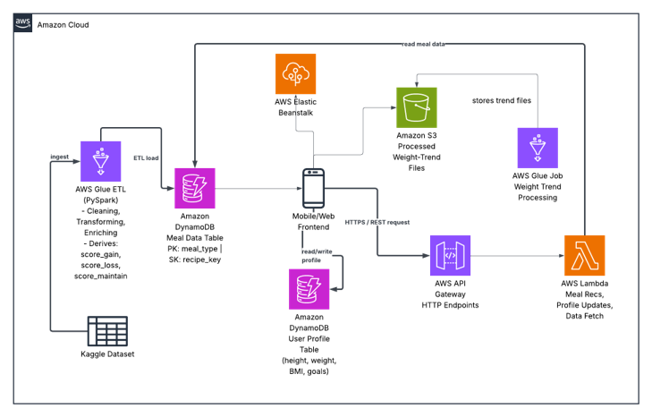

# MealFit: A Meal and Fitness Recommender Application

MealFit is a cloud-native, serverless application that generates **personalised meal plans and weekly workout plans**. It calculates a user's BMI and daily calorie target, recommends four meals a day (breakfast, lunch, snack, dinner) matched to their goal, builds a workout schedule, and tracks weight over time with a trend analysis pipeline.


## Table of Contents

- [Features](#features)
- [Architecture](#architecture)
- [Tech Stack](#tech-stack)
- [How It Works](#how-it-works)
- [API Reference](#api-reference)
- [Data Model](#data-model)
- [Project Structure](#project-structure)
- [Getting Started](#getting-started)
- [CI/CD Pipeline](#cicd-pipeline)
- [Security](#security)


## Features

- **User accounts:** sign up and log in with email and password (passwords are stored hashed)
- **Profile management:** name, height, weight and age, editable at any time
- **BMI and nutrition targets:** calculated through a public BMI API (RapidAPI)
- **Four-meal daily plan:** top 10 recipes ranked by goal (weight loss, gain or maintenance), with macros, ingredients and preparation steps
- **Fitness planner:** weekly workout plan based on goal, available days and fitness level (beginner, intermediate, advanced)
- **Weight trend analysis:** a PySpark job on AWS Glue computes moving averages and weight deltas, and the results are charted for the user
- **Fully serverless backend** with automatic scaling, plus a containerised frontend on Elastic Beanstalk
- **Automated deployment** using GitHub Actions

## Architecture



## Tech Stack

| Area | Technology |
|---|---|
| Data processing | AWS Glue, PySpark |
| Storage | Amazon S3, Amazon DynamoDB |
| Backend | AWS Lambda, Amazon API Gateway |
| External API | RapidAPI BMI Calculator |
| Frontend hosting | AWS Elastic Beanstalk (Docker, auto scaling, load balancer) |
| CI/CD | GitHub Actions, Elastic Beanstalk CLI |
| Dataset | Kaggle recipes (about 65,000 records) |

## How It Works

### 1. ETL on the recipe dataset
The raw Kaggle CSV is uploaded to S3 and processed by an AWS Glue PySpark job that:

- handles multiline and quoted fields, and strips braces, quotes, tabs and newlines with `regexp_replace`
- casts columns to proper numeric types
- derives nutrition features such as `protein_per_100cal` and `fat_per_100cal`
- computes three suitability scores per recipe: `score_loss`, `score_gain` and `score_maintain`
- calculates min, max and average per score to detect and remove outliers
- writes the cleaned data to S3 and loads it into DynamoDB

### 2. Meal recommendation (`/mealplan`)
1. The client sends height, weight, age and gender to API Gateway.
2. Lambda calculates the daily calorie requirement with the **Mifflin-St Jeor** equation.
3. The goal is derived from BMI: **500 kcal is subtracted for weight loss and 500 kcal added for weight gain**.
4. Calories are split across the four meal types, and the top 10 recipes are queried from DynamoDB and ranked by the relevant score.
5. Ingredients and steps are parsed, numeric values converted to floats, and structured JSON is returned.

### 3. Fitness planner (`/fitapi`)
Builds a weekly schedule from the user's goal, available training days and fitness level. Exercises are picked at random from a small set to avoid repetition, with sets and reps adjusted to the level. It also returns nutrition advice for the goal.

### 4. Weight trend analysis
Each weight update appends a `{value, timestamp}` entry to the user's weight history in DynamoDB. When the user opens **Trend Analysis**, a Glue job (`weighttrend`) reads that user's record, computes moving averages and weight deltas with Spark window functions, and writes the result to a user-specific S3 folder. The frontend reads it to draw the progress chart.

## API Reference

### `POST /mealplan`

Request:

```json
{
  "height": 165,
  "weight": 60,
  "age": 25,
  "gender": "female"
}
```

Response (abridged):

```json
{
  "daily_calories": 1114,
  "goal": "loss",
  "meals": {
    "breakfast": {
      "name": "Crock Pot Hot Multigrain Cereal",
      "calories": 278.0,
      "protein": 10.5,
      "servings": "4",
      "ingredients": ["multigrain cereal", "salt", "water", "apples", "raisins"],
      "score_loss": 2.38
    }
  }
}
```

### `POST /fitapi`

Request:

```json
{
  "goal": "muscle_gain",
  "available_days": 5,
  "fitness_level": "intermediate"
}
```

Response (abridged):

```json
{
  "goal": "muscle_gain",
  "week_plan": {
    "Monday": [
      { "exercise": "Bench Press", "sets": 3, "reps": 12 },
      { "exercise": "Squats", "sets": 3, "reps": 12 }
    ]
  }
}
```

**Endpoints (as deployed for the project):**

- `https://z67upt1czc.execute-api.us-east-1.amazonaws.com/mealplan`
- `https://nwjiehffn5.execute-api.us-east-1.amazonaws.com/fitapi`

### External BMI API

Lambda calls the RapidAPI BMI Calculator (`https://bmi-calculator-api-apiverve.p.rapidapi.com/v1/bmicalculator`) with height and weight to get BMI and the recommended goal.

## Data Model

| Table | Keys | Contents |
|---|---|---|
| Meal table | Partition key `meal_type`, sort key `recipe_id` | Recipe name, calories, macros, ingredients, steps, `score_loss` / `score_gain` / `score_maintain` |
| User table | `email_id` | Name, email, hashed password, height, age, weight, `weight_history` (list of `{value, timestamp}`) |

Keeping user data and recipe data in separate tables lowers query complexity and lets each scale independently.


## Getting Started

### Prerequisites

- An AWS account with access to S3, Glue, DynamoDB, Lambda, API Gateway and Elastic Beanstalk
- AWS CLI and EB CLI (`pip install awsebcli`)
- A RapidAPI key for the BMI Calculator API
- Python 3.9+ and Docker

### 1. Clone

```bash
git clone https://github.com/Chaitali-Kadam1008/Scalable_Project.git
cd Scalable_Project
```

### 2. Prepare the data

1. Download the Kaggle recipe dataset and upload the CSV to an S3 bucket.
2. Create and run the Glue ETL job (PySpark) to clean the data, add the three scores and write the output.
3. Load the processed recipes into the DynamoDB meal table (`meal_type` / `recipe_id`).
4. Create the DynamoDB user table (key `email_id`).

### 3. Deploy the backend

1. Create the Lambda functions for meal recommendation and the fitness planner (region `us-east-1`).
2. Create API Gateway HTTP endpoints `/mealplan` and `/fitapi` and connect them to the functions.
3. Store the RapidAPI key as a Lambda environment variable (never in source control).
4. Create the `weighttrend` Glue job, which takes the arguments `JOB_NAME` and `USER_EMAIL`.

### 4. Deploy the frontend

```bash
eb init <app-name> --region us-east-1 --platform "Python 3.9 running on 64bit Amazon Linux 2023"
eb use <environment-name>
eb deploy
```

### 5. Use the app

1. Sign up, then log in.
2. Update your profile (name, height, weight, age).
3. Click **Get BMI** to see your BMI and goal, then open **Meal Plan** and **Fitness Plan**.
4. Add new weight entries over time and open **Trend Analysis** to see your progress.

## CI/CD Pipeline

GitHub Actions deploys to Elastic Beanstalk on a **push to `main`** or a **merged pull request into `main`**.

Steps: checkout (`actions/checkout@v4`) → set up Python 3.9 (`actions/setup-python`) → install the EB CLI → configure AWS credentials → `eb init` / `eb deploy --label "deploy-<run_id>" --timeout 20`.

Required **GitHub Secrets**:

| Secret | Purpose |
|---|---|
| `AWS_ACCESS_KEY_ID` | AWS credentials |
| `AWS_SECRET_ACCESS_KEY` | AWS credentials |
| `AWS_SESSION_TOKEN` | Temporary credentials |
| `AWS_REGION` | Deployment region |
| `EB_APP_NAME` | Elastic Beanstalk application name |
| `EB_ENV_NAME` | Elastic Beanstalk environment name |

Every deployment is labelled with its GitHub Actions run ID for traceability and rollback.

## Security

- Passwords are stored hashed, never in plain text.
- Elastic Beanstalk serves over HTTPS, with limited IAM permissions for each component.
- Weight trend output in S3 is kept in per-user folders, protected by bucket policies and encryption.
- API keys (RapidAPI) and AWS credentials are kept in environment variables or GitHub Secrets, not in the repository.
